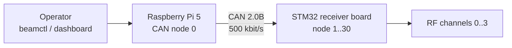

# BeamControl

BeamControl controls four-channel RF receiver boards from a Raspberry Pi 5 over CAN.



One board is one CAN node. Phase shifters and DVGAs are board-local devices.

Current hardware/runtime assumptions:

- receiver MCU clock: 16 MHz HSE -> PLL x3 -> 48 MHz system clock; HSI48 is the bounded fallback
- CAN: 2.0B extended frames at 500 kbit/s
- Raspberry Pi HAT physical CAN0: SPI parent `spi1.1`, exposed to BeamControl as `beamcan0`
- deployed operator CLI: `/usr/local/bin/beamctl`, defaulting to `beamcan0`

## Layout

| Path | Purpose |
|:--|:--|
| `pi/` | Python client, CLI, monitor, dashboard, deployment |
| `stm32/` | STM32F072 firmware |
| `protocol/` | Shared Python/C vectors |
| `simulation/` | Docker/SocketCAN/Renode E2E |
| `tools/` | Setup, checks, bundles |
| `docs/` | Protocol, RF, operations |

## Develop

```bash
make setup
make doctor
make test
make check
make simulation-test
```

## Firmware

```bash
make firmware NODE=1
make firmware-size NODE=1
```

Node IDs are `1..30` and must be unique. Outputs are under `stm32/app/build/`.

## Controller

```bash
beamctl discover
beamctl ping 1
beamctl set-phase 1 --state 128 --channel 2
beamctl set-phase 1 --states 128 64 32 16
beamd --config /etc/uorocketry/beamcontrol.toml
```

`beamctl` supports individual and four-channel phase, VGA, combined, and safe commands. See the [Pi controller](pi/README.md) for the complete CLI. `beamd` serves a read-only dashboard on port `8080` and remains available when CAN is offline.

## Docs

- [Overview](docs/overview.md)
- [CAN protocol](docs/can-protocol.md)
- [RF encoding](docs/rf-control.md)
- [Developer setup](docs/operations/developer-setup.md)
- [Pi deployment](docs/operations/pi-provisioning.md)
- [Releases](docs/operations/releases.md)
