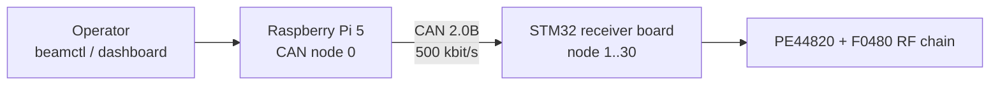

# BeamControl

BeamControl controls single-chain RF receiver boards from a Raspberry Pi 5 over CAN.
It contains the Raspberry Pi controller, STM32F072 receiver firmware, a shared CAN
protocol contract, deployment tooling, and host-side simulation/tests.



One board is one CAN node and one RF chain. The board-local PE44820 phase shifter and
F0480 attenuator are selected by the receiver's CAN node ID, not by a channel field.

Current hardware/runtime assumptions:

- receiver MCU clock: 16 MHz HSE -> PLL x3 -> 48 MHz system clock; HSI48 is the bounded fallback
- CAN: 2.0B extended frames at 500 kbit/s
- Raspberry Pi HAT physical CAN0: SPI parent `spi1.1`, exposed to BeamControl as `beamcan0`
- deployed operator CLI: `/usr/local/bin/beamctl`, defaulting to `beamcan0`

## Layout

| Path | Purpose |
|:--|:--|
| `pi/` | Python client, CLI, monitor, dashboard, deployment |
| `stm32/` | STM32F072 firmware |
| `protocol/` | Shared Python/C vectors |
| `simulation/` | Docker/SocketCAN/Renode E2E |
| `tools/` | Setup, checks, bundles |
| `docs/` | Protocol, RF, operations |

## Develop

The supported development host is Linux. On Windows use WSL2; see
[developer setup](docs/operations/developer-setup.md) for the limited macOS workflow.

```bash
make setup
make doctor
make test
make check
make simulation-test
```

## Firmware

```bash
make firmware NODE=1
make firmware-size NODE=1
```

Node IDs are `1..30` and must be unique. Outputs are under `stm32/app/build/`.

## Controller

```bash
beamctl discover
beamctl ping 1
beamctl set-phase 1 --state 128
beamctl set-vga 1 --attenuation 8
beamctl set-combined 1 --state 128 --attenuation 8
beamctl enter-safe 1
beamd --config /etc/uorocketry/beamcontrol.toml
```

Each receiver node controls the one RF chain shown in the R2A schematic. `beamctl`
supports phase, VGA, combined, and safe commands. See the [Pi controller](pi/README.md)
for the complete CLI. `beamd` serves a read-only dashboard on port `8080` and remains
available when CAN is offline.

`ACK` means that the STM32 completed its write sequence. Neither RF device has a
readback connection, so an ACK does not prove the requested RF state electrically.

## Before hardware use

1. Assign every receiver a unique node ID from `1..30` at firmware build time.
2. Install two 120-ohm CAN terminators, one at each physical end of the bus.
3. Power the Pi and receivers with a shared CAN reference/ground as specified by the
   hardware design.
4. Start at maximum attenuation and follow the
   [hardware validation checklist](docs/hardware-validation.md).
5. Treat the project as unqualified until the checks in
   [project status](docs/project-status.md) are complete for the actual PCB revision.

## Docs

- [Overview](docs/overview.md)
- [Project status and known limits](docs/project-status.md)
- [CAN protocol](docs/can-protocol.md)
- [RF encoding](docs/rf-control.md)
- [Developer setup](docs/operations/developer-setup.md)
- [Pi deployment](docs/operations/pi-provisioning.md)
- [Releases](docs/operations/releases.md)
