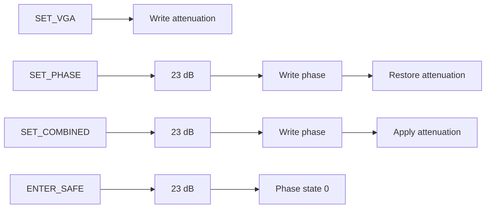

# BeamControl CAN protocol v3.0

Implemented by the Pi client, STM32 firmware, and shared vectors.

## Bus

| Property | Value |
|:--|:--|
| Frame | Classical CAN 2.0B extended data |
| Bitrate | 500 kbit/s |
| Sample point / SJW | 87.5% / 1 TQ |
| Controller | Node `0` |
| Receivers | Nodes `1..30` |
| Broadcast | `31` |
| Payload | 0..8 bytes |

## Identifier

```text
28:26 TYPE
25:21 DEST
20:16 SOURCE
15:0  SEQUENCE
```

```text
id = (type << 26) | (dest << 21) | (source << 16) | sequence
```

Responses swap source/destination and preserve sequence. `ENTER_SAFE` has the highest command priority because its type is `0`.

## RF topology

One receiver board is one CAN node and one RF chain. Select the RF path by node
ID; there is no channel field inside an RF command. The board's single PE44820
uses serial address 1.

## Messages

| Type | Name | Direction | Exact payload |
|:--|:--|:--|:--|
| `0` | `ENTER_SAFE` | Controller -> receiver | empty |
| `1` | `SET_COMBINED` | Controller -> receiver | `[state, atten]` |
| `2` | `SET_PHASE` | Controller -> receiver | `[state]` |
| `3` | `SET_VGA` | Controller -> receiver | `[atten]` |
| `4` | `PING` | Controller -> receiver | empty |
| `5` | `STATUS` | Receiver -> controller | 8 bytes |
| `6` | `ACK` | Receiver -> controller | `[command_type, result]` |
| `7` | `ERROR` | Receiver -> controller | `[command_type, result]` |

Ranges:

- phase state: `0..255`, index into the calibrated 2.4 GHz enum
- attenuation: `0..23` dB

Commands require exact DLCs:

| Command | DLC |
|:--|--:|
| `ENTER_SAFE` | 0 |
| `SET_PHASE` | 1 |
| `SET_VGA` | 1 |
| `SET_COMBINED` | 2 |

`PING` is also empty.

## Execution order



The planner validates the complete frame before hardware writes. Broadcast is allowed only for `ENTER_SAFE`.

## ACK, retries, replay

A unicast state-changing request returns:

- `ACK` after validation and planned STM32 SPI transfers complete
- `ERROR` on decode, validation, sequence, or execution failure. An RF/SPI
  execution fault returns `HARDWARE`; the board records the diagnostic fault
  and leaves its software state at the last fully completed plan.

ACK is not RF-device readback; neither RF interface has MISO connected.

The client matches source, destination, sequence, and command type. Default timeout: 20 ms. Default retries: two, using identical ID, DLC, and bytes. A final timeout means hardware state is unknown.

The receiver caches the latest successful unicast state-changing request:

- identical retry: replay ACK, no RF writes
- same source/type/sequence with different DLC or data: `SEQUENCE_REUSE`
- broadcast: no cache, no response

## Results

| Value | Name | Meaning |
|:--|:--|:--|
| `0` | `OK` | Completed on STM32 |
| `1` | `INVALID_LENGTH` | Unsupported DLC |
| `2` | `INVALID_PAYLOAD` | Invalid phase state or attenuation |
| `3` | `UNSUPPORTED` | Not a controller command |
| `4` | `HARDWARE` | Hardware operation failed |
| `5` | `BUSY` | Cannot accept command |
| `6` | `SEQUENCE_REUSE` | Same key, different request bytes |
| `7` | `BROADCAST_NOT_ALLOWED` | Non-safe broadcast |

## Status and discovery

`PING` returns one STATUS frame:

```text
0 protocol major (3)
1 protocol minor (0)
2 protocol patch (0)
3 node ID
4 health flags
5 RX-drop count low byte
6 TX-drop count low byte
7 invalid-command count low byte
```

Version matching is exact.

Health-flag byte:

| Bit | Name | Meaning |
|--:|:--|:--|
| 0 | `CLOCK_FALLBACK` | HSE failed and firmware is using HSI48 |
| 1 | `RX_DROPPED` | At least one received frame was dropped |
| 2 | `INVALID_COMMAND` | At least one invalid request was observed |
| 3 | `SAFE_LOCKOUT` | Retained boot diagnostics require safe lockout |
| 4 | `BUS_OFF` | CAN controller entered bus-off state |
| 5 | `TX_DROPPED` | At least one response could not be queued/sent |

Counters in STATUS are low-byte diagnostic counters and may wrap. A nonzero health flag
is diagnostic state, not RF-device readback.

## Contract vectors

- Source: `protocol/v3.0-vectors.toml`
- Generated C: `protocol/generated/protocol_vectors.h`

```bash
python3 tools/generate-protocol-vectors.py
```
