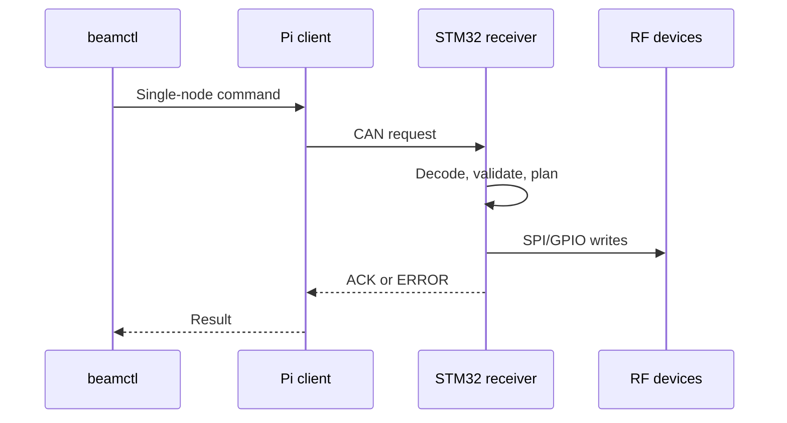

# BeamControl overview

BeamControl separates Pi supervision from deterministic STM32 RF control. One receiver
board is one CAN node and controls one RF chain.

## Command path

ACK confirms STM32 transfer completion, not RF-device readback. `beamd` continuously discovers boards and serves the read-only status dashboard. Browser live state uses Server-Sent Events; the server publishes only UI atoms whose state changed instead of polling or replacing whole cards. Pi releases are self-contained around pinned `uv` + CPython 3.11 rather than the host system Python.

## Responsibilities

| Component | Owns | Does not own |
|:--|:--|:--|
| `beamctl` | Operator commands and synchronous replies | Continuous monitoring |
| `beamd` | Discovery, health state, events, read-only web UI | RF control endpoints |
| Pi SocketCAN service | Stable `beamcan0` interface and bitrate | Receiver-node configuration |
| STM32 firmware | CAN validation, replay protection, safe RF write ordering | RF-device readback |
| Shared vectors | Python/C wire-contract agreement | Electrical validation |

## Receiver board map

The R2A schematic and STM32F072 datasheet define the production pin map. Keep these
assignments centralized in `stm32/app/include/platform/board.h`.

| Function | STM32 pin | Peripheral/AF |
|:--|:--|:--|
| CAN RX | PA11 | CAN AF4 |
| CAN TX | PA12 | CAN AF4 |
| PE44820 LE | PB12 | GPIO |
| PE44820 clock | PB13 | SPI2 AF0 |
| PE44820 serial input | PB15 | SPI2 AF0 |
| PE44820 serial/parallel select | PC7 | GPIO, driven high |
| PE44820 OPT | PA3 | GPIO, driven low |
| PE44820 address A0 | PA4 | GPIO, driven high |
| PE44820 address A1/A2/A3 | PA5/PA6/PC4 | GPIO, driven low |
| F0480 chip select | PA15 | GPIO |
| F0480 clock | PB3 | SPI1 AF0 |
| F0480 data | PB5 | SPI1 AF0 |

The resulting PE44820 serial address is `1`. Both RF buses are transmit-only.

## Safety behavior

- Startup writes maximum attenuation before programming phase.
- A phase-only change temporarily applies 23 dB, writes phase, then restores attenuation.
- A combined change applies 23 dB, writes phase, then applies requested attenuation.
- `ENTER_SAFE` applies 23 dB and phase state `0`.
- Repeated incomplete boots can place firmware in retained safe lockout.
- SPI execution failures produce a protocol `HARDWARE` error and retained diagnostics.
- Broadcast is accepted only for `ENTER_SAFE`; all other RF commands are unicast.

## Current hardware/runtime contract

| Component | Current configuration |
|:--|:--|
| Receiver MCU | STM32F072R8T6 |
| Receiver clock | 16 MHz HSE, PLL x3, 48 MHz system clock; HSI48 fallback |
| Receiver CAN pins | PA11 RX / PA12 TX, AF4 |
| CAN bus | CAN 2.0B extended, 500 kbit/s |
| Pi CAN connector | HAT physical CAN0, MCP2515 at `spi1.1` |
| Application CAN name | `beamcan0` |
| Pi application runtime | bundled uv-managed CPython 3.11 |
| Operator CLI | `/usr/local/bin/beamctl`; `beamcan0` is the default interface |

## Test layers

| Layer | Coverage |
|:--|:--|
| Unit/contract | Python and native C logic |
| Renode E2E | Pi client, SocketCAN, STM32 ELF, SPI/GPIO |
| ARM64 bundle | Offline Pi installation |
| Hardware validation | Electrical timing, wiring, RF performance |

Run `make check` for static/unit/build gates and `make simulation-test` for Renode E2E.
