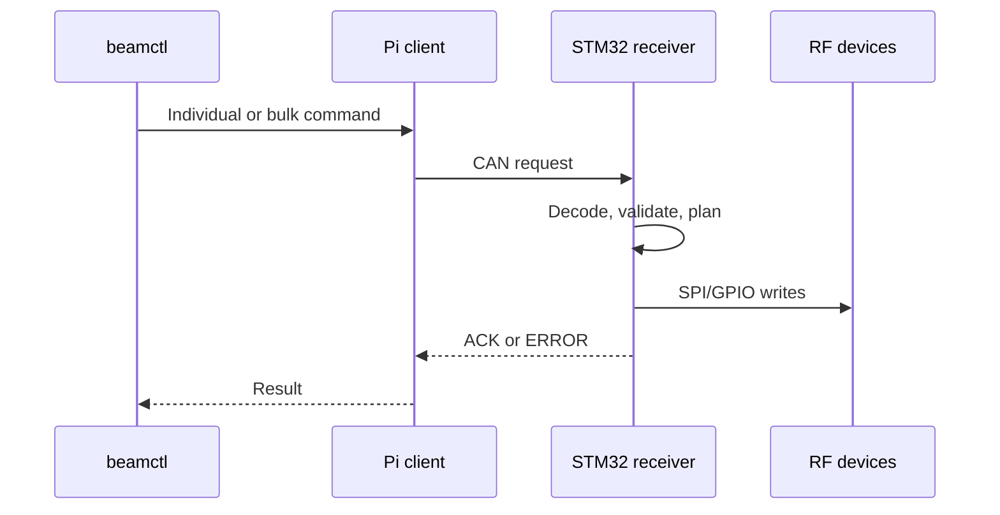

# BeamControl overview

BeamControl separates Pi supervision from deterministic STM32 RF control. One receiver board is one CAN node; its four RF channels are local peripherals.

## Command path

ACK confirms STM32 transfer completion, not RF-device readback. `beamd` continuously discovers boards and serves the read-only status dashboard. Browser live state uses Server-Sent Events; the server publishes only UI atoms whose state changed instead of polling or replacing whole cards. Pi releases are self-contained around pinned `uv` + CPython 3.11 rather than the host system Python.

## Current hardware/runtime contract

| Component | Current configuration |
|:--|:--|
| Receiver MCU | STM32F072R8T6 |
| Receiver clock | 16 MHz HSE, PLL x3, 48 MHz system clock; HSI48 fallback |
| Receiver CAN pins | PA11 RX / PA12 TX, AF4 |
| CAN bus | CAN 2.0B extended, 500 kbit/s |
| Pi CAN connector | HAT physical CAN0, MCP2515 at `spi1.1` |
| Application CAN name | `beamcan0` |
| Pi application runtime | bundled uv-managed CPython 3.11 |
| Operator CLI | `/usr/local/bin/beamctl`; `beamcan0` is the default interface |

## Test layers

| Layer | Coverage |
|:--|:--|
| Unit/contract | Python and native C logic |
| Renode E2E | Pi client, SocketCAN, STM32 ELF, SPI/GPIO |
| ARM64 bundle | Offline Pi installation |
| Hardware validation | Electrical timing, wiring, RF performance |

Run `make check` for static/unit/build gates and `make simulation-test` for Renode E2E.
