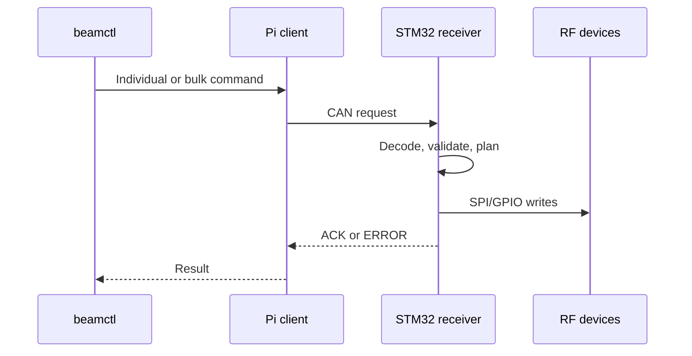

# BeamControl overview

BeamControl splits Pi supervision from deterministic STM32 RF control.

## Pi

- Sends individual or four-channel commands.
- Discovers and monitors receivers.
- Serves the read-only dashboard.
- Uses Linux SocketCAN.

## STM32

- Validates CAN frames.
- Converts phase indexes and attenuation values to RF serial words.
- Attenuates before phase changes.
- Returns ACK, ERROR, and STATUS.
- Uses replay protection, watchdog recovery, and retained diagnostics.

A board is one CAN node; RF devices are local peripherals.

## Command path



ACK confirms STM32 transfer completion, not RF-device readback.

## Compared with the original prototype

| Area | Prototype | BeamControl |
|:--|:--|:--|
| Runtime | One hard-coded write | Continuous CAN node |
| Commands | None | Discovery, individual/bulk RF updates, safe mode |
| VGA | Driver unused by `main` | Initialized and controlled |
| Phase safety | None | Attenuate, phase, restore/apply |
| SPI | No bounded completion wait | Guarded transfer and timeout |
| Validation | Minimal | ID, type, DLC, ranges, broadcast, replay |
| Recovery | Debug/infinite loop | Fault record, reset, safe lockout, watchdog |
| CAN | None | Filters, queues, priorities, bus-off recovery |
| Tests | Manual | Python, native C, contract, ARM build, Renode E2E |

## Dashboard

`beamd` shows Pi/service, CAN, receiver health, protocol, latency, and recent events. It is read-only and remains available during CAN failures.

## Test layers

| Layer | Coverage |
|:--|:--|
| Unit/contract | Python and C logic |
| Renode E2E | Pi client, SocketCAN, real STM32 ELF, SPI/GPIO |
| ARM64 bundle test | Offline Pi installation |
| Hardware validation | Electrical timing, CAN wiring, RF performance |

```bash
make simulation-test
```
