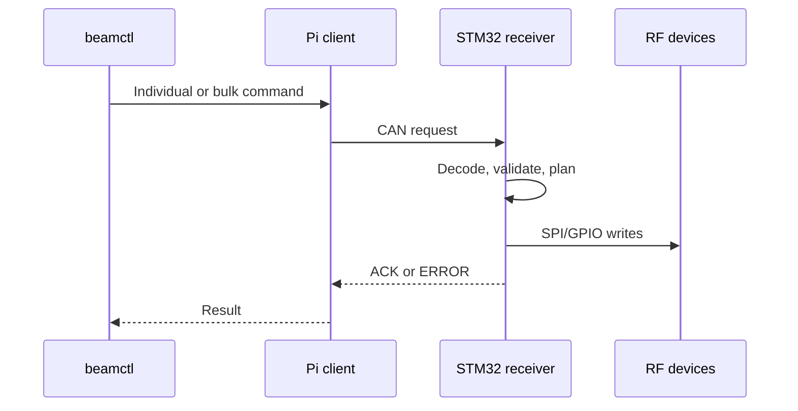

# BeamControl overview

BeamControl separates Pi supervision from deterministic STM32 RF control. One receiver board is one CAN node; its four RF channels are local peripherals.

## Command path

ACK confirms STM32 transfer completion, not RF-device readback. `beamd` continuously discovers boards and serves the read-only status dashboard. Browser live state uses Server-Sent Events; the server publishes only UI atoms whose state changed instead of polling or replacing whole cards. Pi releases are self-contained around pinned `uv` + CPython 3.11 rather than the host system Python.

## Test layers

| Layer | Coverage |
|:--|:--|
| Unit/contract | Python and native C logic |
| Renode E2E | Pi client, SocketCAN, STM32 ELF, SPI/GPIO |
| ARM64 bundle | Offline Pi installation |
| Hardware validation | Electrical timing, wiring, RF performance |

Run `make check` for static/unit/build gates and `make simulation-test` for Renode E2E.
