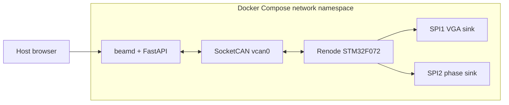

# Virtual end-to-end simulation



Docker Compose creates `vcan0` inside its network namespace; the host gets no CAN interface.

## Run

Requirements: Docker Compose, Linux `vcan`, ARM toolchain, libopencm3.

```bash
sudo modprobe vcan   # when built as a module
make simulation-test
```

The test verifies dashboard health, protocol 2.1 discovery, individual and bulk RF commands, safe mode, ACKs, SPI words, and GPIO latch/CS writes.

Interactive mode:

```bash
make simulation-up
# http://127.0.0.1:18080
make simulation-down
```

Set `BEAMCONTROL_SIM_PORT` to change the host port.

## Scope

Renode validates digital software behavior, not RF performance, voltages, physical timing, CAN termination, oscillator tolerance, brownouts, or watchdog expiry. Those require hardware tests.
