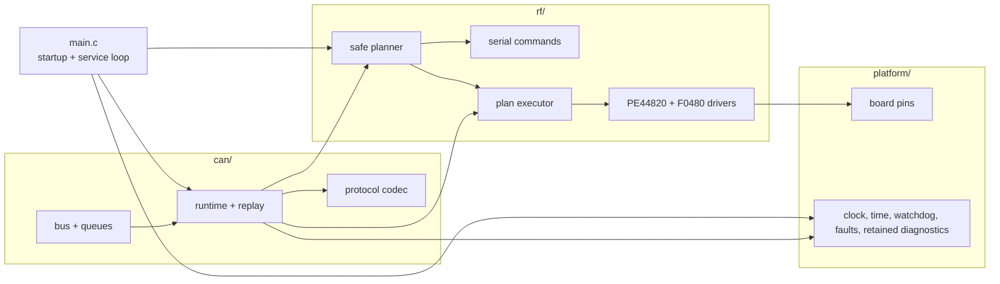

# STM32 receiver firmware

Bare-metal C/libopencm3 firmware for STM32F072R8T6. Each board is one CAN node (`1..30`) with four RF channels (`0..3`).

## Behavior

- 48 MHz clock from 16 MHz HSE / PLL x3, with bounded HSI48 fallback
- watchdog and retained fault/reset record
- safe maximum-attenuation startup
- CAN protocol 2.1 from controller node `0`
- individual and bulk phase/VGA updates
- attenuation before phase changes
- filtered RX, prioritized TX, replay-safe retries, bus-off recovery

## Build

```bash
make firmware NODE=1
make firmware-size NODE=1
```

`NODE` is required and must be unique. Outputs are under `stm32/app/build/`.

## Test

```bash
make stm32-test
make stm32-sanitize
make stm32-static
make check
```

## Target

| Property | Value |
|:--|:--|
| MCU | STM32F072R8T6, Cortex-M0 |
| Flash / RAM | 64 KiB / 16 KiB |
| Clock | 48 MHz, 16 MHz HSE / PLL x3 with HSI48 fallback |
| CAN | 2.0B extended, 500 kbit/s, PA11/PA12 AF4 |
| Phase bus | SPI2 |
| VGA bus | SPI1 |

Both RF buses are transmit-only. ACK means the STM32 completed the transfer, not that an RF IC accepted or applied it.

## Source map



```text
app/src/main.c       startup and service loop
app/src/can/         CAN hardware, codec, queues, runtime
app/src/rf/          RF encoding, planning, execution, drivers
app/src/platform/    board map, clock, time, faults, retained diagnostics
app/include/         matching public headers
tests/               native unit and contract tests
```

See [RF encoding](../docs/rf-control.md) and [hardware validation](../docs/hardware-validation.md).
